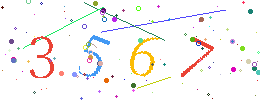

# go-captcha
golang 实现普通验证码,同时支持中文汉字点击行为验证码

- 英文数字验证
- 中文点选验证
- 干扰线
- 干扰点
- 自定义背景颜色
- 自定义字体颜色
- 自定义倾斜角度
- 自定义字体大小
- 自定义字体

## Preview

 

 


## Quick Start 使用

*普通验证码*
```
import (
   "github.com/feiin/go-captcha"
)

cpt := captcha.NewCaptcha(260, 100)

//cpt.SetFontColors(...)
//cpt.SetFont(...)
//cpt.SetFontSize(...)
//cpt.SetSytle(...)
//cpt.SetBackgroundColor(...)


//获取4位随机验证码
result,err := cpt.GenRandomNormalCaptcha(4)

//result 属性
//    - DrawRects   []DrawRect 随机验证码位置
//	  - Text        string     随机验证码字符
//	  - ImageBase64 string     随机验证码base64编码

```

*中文点击行为验证码*

> 验证码输出展示 -> 上传用户行为 -> 验证点击行为数据

```

import (
   "github.com/feiin/go-captcha"
)

//........................................


cpt := captcha.NewCaptcha(260, 100)
cpt.SetBackgroundColor(color.RGBA{R: uint8(20), G: uint8(8), B: uint8(100), A: uint8(255)})
cpt.Config.Style = captcha.CaptchaStyle_Behavior
cpt.Config.MaxRotate = 20
result, err := cpt.GenBehaviorCNCaptcha()

//可以将result或result.DrawRects信息者结果存入redis或程序内存中等,当上传用户点击行为时，做位置信息校验

//当用户点击验证后，上传点击[]Point位置信息,后端校验
if captcha.ValidBehaviorCaptcha(result,points) {
    //验证通过
} else {
    //验证未过
}

//rects = result.DrawRects
//if captcha.ValidBehaviorRects(rects,points) {
    ////验证通过
//} else {
    ////验证未过
//}

```


## Config属性

```
type Config struct {
	FontColors     []color.Color
	BackgroupColor color.Color //default white
	FontSize       int         //default 56
	MaxRotate      int         //default 30
	Style          CaptchaStyle
	Font           *truetype.Font //字体
}
```
- FontColors 字体颜色,多个时随机字体颜色
- BackgroupColor 背景颜色
- FontSize 字体大小
- MaxRotate 最大旋转角度
- Style CaptchaStyle_Normal普通验证码，CaptchaStyle_Behavior点击行为验证码


Config设置方法
```

cpt := NewCaptcha(260, 100)
cpt.Config.FontSize = 24 //等同cpt.SetFontSize(24)
//... 


```
